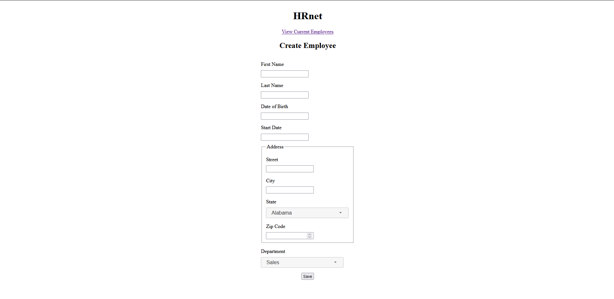
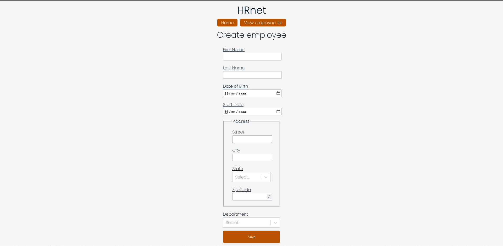

# HRnet, OpenClassrooms project #14

HRnet application allows to add new employee data and display current employees in a data table.

The repository of the original project is [here](https://github.com/OpenClassrooms-Student-Center/P12_Front-end).

I have converted the modal component. The repository is Here

**Old version of HRnet**

<kbd></kbd>

**New version of HRnet**

<kbd></kbd>

## Prerequisites

-   [npm](https://www.npmjs.com/) v9.2.0

## Dependencies

-   [React](https://reactjs.org/) v18.2.0

-   [Redux](https://redux.js.org/) v4.1.2

-   [react-redux](https://react-redux.js.org/) v8.0.5

-   [react-router-dom](https://reactrouter.com/web/guides/quick-start) v6.8.0

-   [react-table](https://react-table-v7.tanstack.com/) v7.8.0

## Install this project on your local

-   Fork this repository

-   Clone to your local on a directory of your choice.

-   From the terminal, change directory to the cloned project directory.

-   Install with command `npm install`

-   Run the project with command `npm start`

This application will run on `http://localhost:3000`